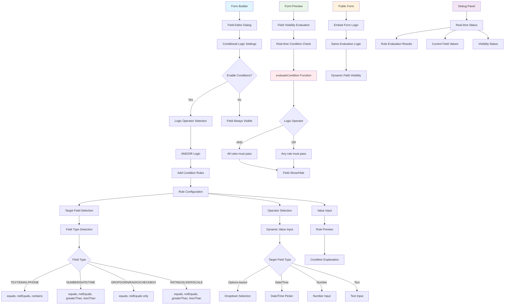
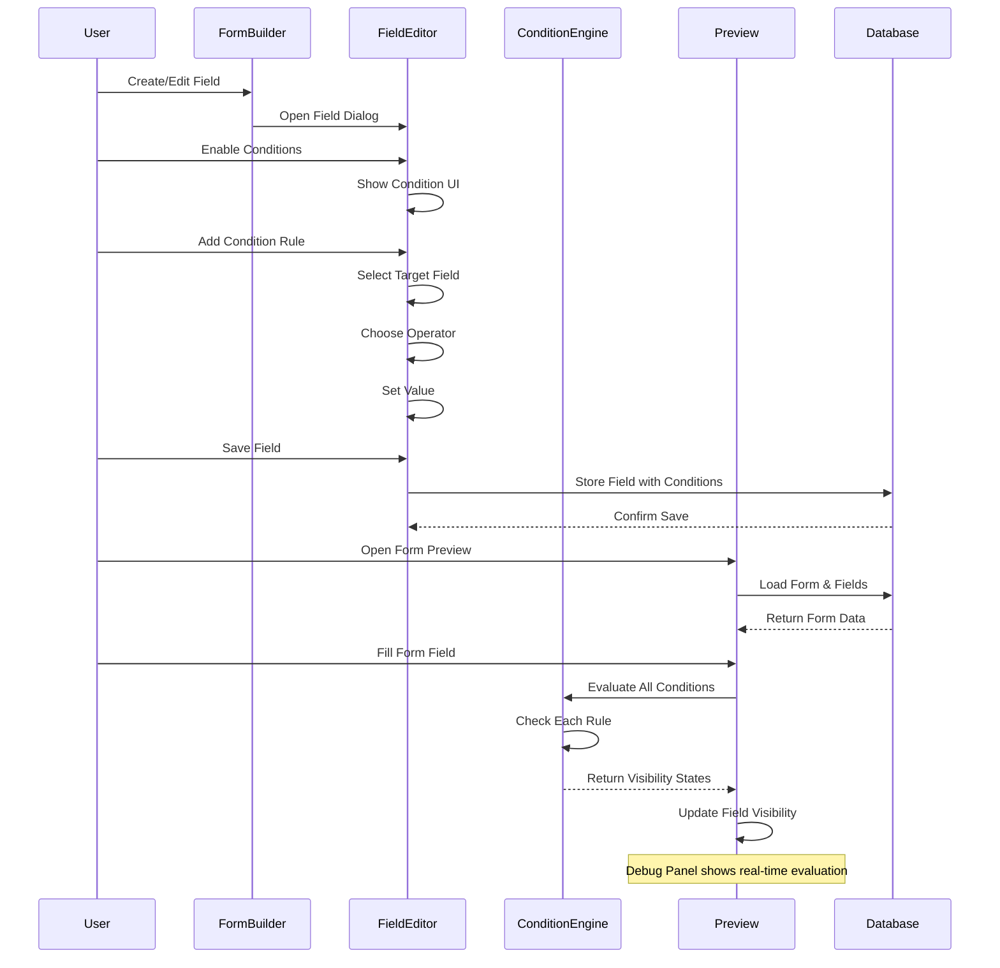
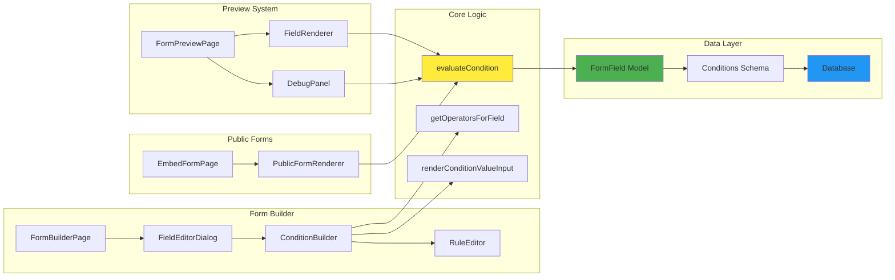
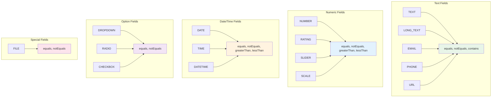
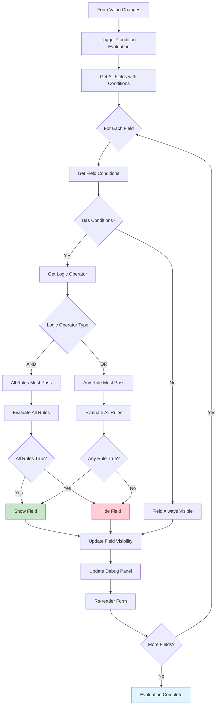
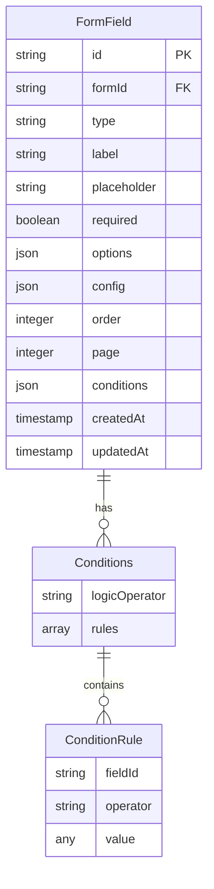
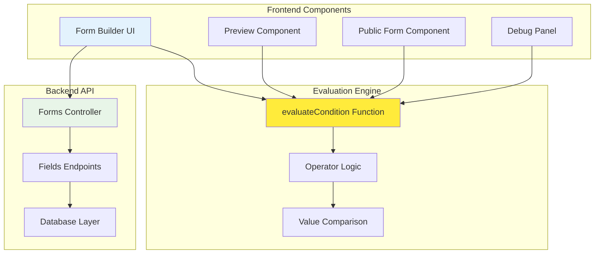

# Conditional Logic Architecture Diagrams

## System Overview Diagram

## Data Flow Diagram

## Component Architecture

## Field Type Support Matrix

## Condition Evaluation Flow

## Database Schema Diagram

## Integration Points

---

**Generated**: June 3, 2025  
**Purpose**: Visual reference for conditional logic architecture  
**Maintenance**: Update when system architecture changes 